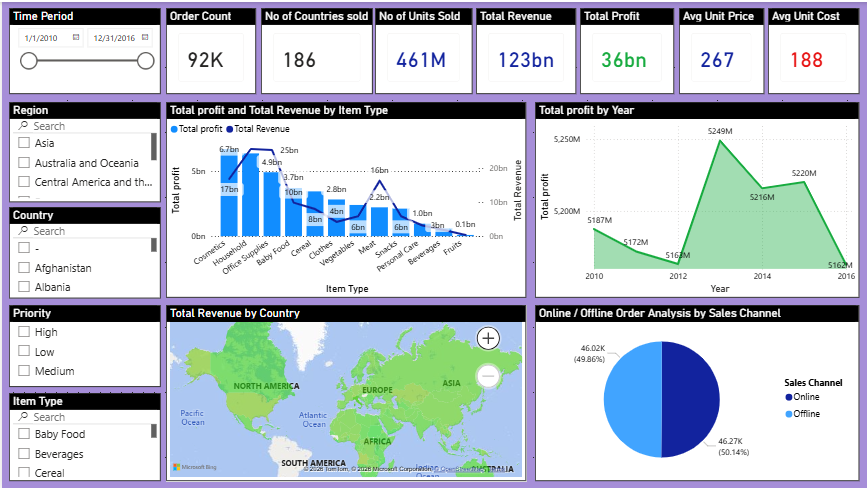

# 📊 Power BI Sales Dashboard

An interactive sales analytics dashboard built with **Microsoft Power BI**, providing comprehensive insights into sales performance, trends, and key business metrics.

## 🖼️ Dashboard Preview



## 📌 Overview

This project delivers an end-to-end sales analytics solution that transforms raw sales data into actionable visual insights. The dashboard enables business stakeholders to monitor KPIs, track revenue trends, analyze product performance, and make data-driven decisions in real time.

## ✨ Features

- 💰 **Sales Performance Overview** — Total revenue, units sold, and profit margins at a glance
- 📈 **Time-Series Analysis** — Month-over-month and year-over-year sales trends
- 🛍️ **Product & Category Breakdown** — Top-performing products and category-level comparisons
- 🌍 **Regional / Geographic Insights** — Sales distribution across regions or territories
- 👥 **Customer Segmentation** — Analysis by customer group or segment
- 🎛️ **Interactive Filters & Slicers** — Dynamic filtering by date, region, category, and more
- 🔍 **Drill-through Pages** — Deep-dive into specific segments from summary views

## 📁 Files

| File | Description |
|------|-------------|
| `powerbi_sales_dashboard.pbix` | 📋 Main Power BI Desktop report file |
| `Dataset.xlsx` | 📂 Source dataset used in the report |
| `Output.png` | 🖼️ Dashboard screenshot / preview |

## 🚀 Getting Started

### ✅ Prerequisites

- [Microsoft Power BI Desktop](https://powerbi.microsoft.com/desktop/) (latest version recommended)

### 🔧 Steps

1. **Clone the repository**
   ```bash
   git clone https://github.com/your-username/powerbi-sales-dashboard.git
   cd powerbi-sales-dashboard
   ```

2. **Open the report**
   - Launch **Power BI Desktop**
   - Open `powerbi_sales_dashboard.pbix`

3. **Refresh the data** *(if needed)*
   - Go to **Home → Refresh** to reload data from `Dataset.xlsx`
   - Ensure the `Dataset.xlsx` file path is correctly set under **Transform Data → Data Source Settings**

4. **Explore the dashboard**
   - Use slicers and filters to interact with the visuals
   - Click on charts to cross-filter across the report

## 🗃️ Dataset

The dataset (`Dataset.xlsx`) contains sales transaction records including fields such as:

- 📅 Order Date
- 🏷️ Product / Category
- 🗺️ Region / Territory
- 💵 Sales Amount, Quantity, Profit
- 🧑 Customer information

> **💡 Note:** The dataset is included for demonstration purposes. You can replace it with your own data by updating the data source in Power BI Desktop.

## 🛠️ Tools & Technologies

| Tool | Purpose |
|------|---------|
| 📊 Microsoft Power BI Desktop | Report authoring & data modelling |
| 📗 Microsoft Excel (.xlsx) | Data source |
| 🧮 DAX (Data Analysis Expressions) | Custom measures & calculated columns |
| ⚙️ Power Query (M Language) | Data transformation & cleaning |

## 📄 License

This project is licensed under the [MIT License](LICENSE).

---

⭐ *If you found this project useful, feel free to star the repo, open issues, or submit pull requests with improvements!*
